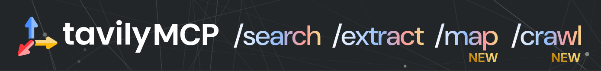

<!-- Banner -->

<!-- Replace 'Banner_NEW.png' with the relative path or URL of your banner asset -->

<p align="center">
  
</p>

<!-- Hero Demo -->

<!-- Convert your video to GIF or use a static demo image -->

<p align="center">
  
</p>

<h1 align="center">Tavily — The Web Access Layer for AI&nbsp;Agents 🚀</h1>
<p align="center"><em>Search • Extract • Map • Crawl</em></p>

Tavily equips developers with blazing‑fast, reliable APIs to programmatically **search** content, **extract** data, **map** site structures, and **crawl** entire domains — purpose‑built for AI agents and Retrieval‑Augmented Generation (RAG) workflows.

* ⏱ **Real‑time** responses in sub‑second latency
* 🔒 **Secure** & production‑ready infrastructure
* 🛟 **Scalable** — from one request to millions
* 🤝 Trusted by **600 000+ developers** worldwide

---

## 📚 Repositories

### Core SDKs

<div align="center">

[](https://github.com/tavily-ai/tavily-python)
[](https://github.com/tavily-ai/tavily-js)

</div>

### Tools & Integrations

<div align="center">

[](https://github.com/tavily-ai/tavily-mcp)
[](https://github.com/tavily-ai/meeting-prep-agent)

</div>

### Examples & Beta

<div align="center">

[](https://github.com/tavily-ai/use-cases)
[](https://github.com/tavily-ai/tavily-crawl-beta-test)

</div>

---

## 🚀 Quick Start

```bash
# Python
pip install tavily

# JavaScript / TypeScript
npm install tavily
```

See our **[docs](https://docs.tavily.com)** for full API reference & guides.

---

## 🤝 Community & Support

| Channel | Link | Purpose |
| ------- | ---- | ------- |
| **API Keys** | [https://app.tavily.com/api-keys](https://app.tavily.com/api-keys) | Generate & manage your Tavily credentials |
| **Playground** | [https://playground.tavily.com](https://playground.tavily.com) | Test queries & see live responses without writing code |
| **Docs** | [https://docs.tavily.com](https://docs.tavily.com) | Comprehensive guides & API reference |
| **Blog** | [https://blog.tavily.com](https://blog.tavily.com) | Engineering deep‑dives, release notes & tutorials |
| **Discord** | [https://discord.gg/tavily](https://discord.gg/tavily) | Chat with the team & community, get help, share projects |
| **Issue Tracker** | [GitHub Issues](https://github.com/tavily-ai/tavily-python/issues) | Report bugs, request features |

---

## 🌟 Ready to build something amazing?

Get your API key, fire up the playground, and start shipping in minutes:

⭐ **[Star our SDK repos](https://github.com/tavily-ai)**  
▶️ **[Try the playground](https://playground.tavily.com)**  
📖 **[Read the docs](https://docs.tavily.com)**  

Built with ❤️ by the Tavily team — making the web instantly accessible for AI.
